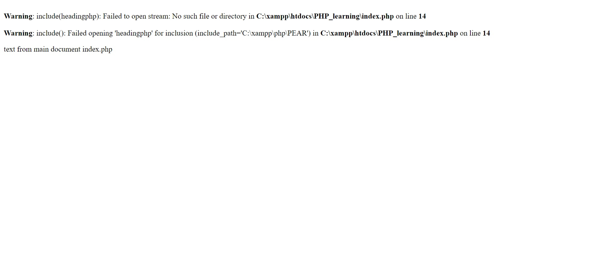
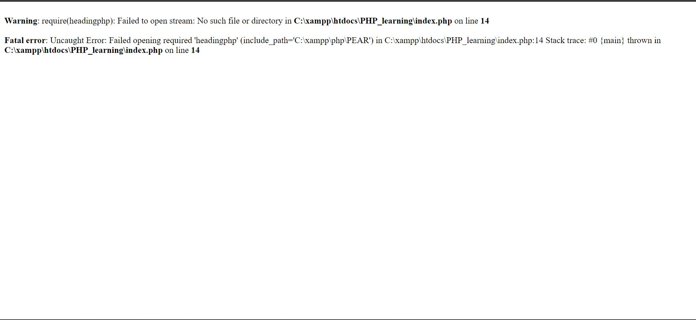

# 09.PHP - INCLUDE AND REQUIRE  KEYWORDS

Both those statements are made for including any pieces of code to a root one. This concept might be similar to components in Vue.js. 

Including files is very useful when you want to embeed the same PHP, HTML, or text on multiple pages of a website.

The main difference between keywords:
- <span style="color: pink">include</span> - if embeeding fails, it will return a warning (E_WARNING) and code below will be runing;
- <span style="color: pink">require</span> - if embeeding fails, it will return a fatal error (E_COMPILE_ERROR) and script below will be stoped.
  
## Examples?

***include:***
```php
// heading.php
echo "<h1>Heading from heading.php</h1>";
```
```php
// index.php
<!DOCTYPE html>
<html lang="en">
<head>
    <meta charset="UTF-8">
    <meta name="viewport" content="width=device-width, initial-scale=1.0">
    <title>something</title>
</head>
<body>
    <?php include "heading.php"?>
    <p>text from main document index.php</p>
</body>
</html>
```
Following result will be displayed:


If we imagine, that our script is not valid, or there is no such file, following warning will be shown:

We see, that it shows a warning, but the string "text from main document index.php" was outputed, which means, - <span style="color: pink">include</span> does not stop the script.

***require:***
```php
// heading.php
echo "<h1>Heading from heading.php</h1>";
```
```php
// index.php
<!DOCTYPE html>
<html lang="en">
<head>
    <meta charset="UTF-8">
    <meta name="viewport" content="width=device-width, initial-scale=1.0">
    <title>something</title>
</head>
<body>
    <?php require "heading.php"?>
    <p>text from main document index.php</p>
</body>
</html>
```
The result will be exactly the same as by using <span style="color: pink">include</span> keyword. But if there is any error in component file, or there is an issue, following error will be displayed:

Fatal error shown, and script below is not working anymore.


___
Link to the w3school reference about include and require you will find 
<a href="https://www.w3schools.com/php/php_includes.asp">here</a>.