# 11.PHP - SQL database

Database is a big collection of data, which can be stored in tables on the backend of an application. Most popular database language is SQL (Structured query language) and it is made for creation of databases and tables, inserting data to the table, selecting any information and so on. In this chapter we will cover all most common-used concepts of this language.

One of the most important parts of backend web development is storing and interaction with data, which we recieve from frontend. With help of this data we can show personalized page wich can be for example a user account. So knowing SQL or any other database language is essantial for backend developers.

In this tutuorial we will use phpmyadmin tool for interaction with SQL databases.

## Creation and deleating of databases and tables?

For creation of any new entity in SQL we should use ***CREATE*** keyword. To create a new database, use *CREATE DATABASE* statement:
```SQL
CREATE DATABASE my_first_database
```
And CREATE TABLE for creation of table:
```SQL
CREATE TABLE users
```

***DROP TABLE*** or ***DROP DATABASE*** are made for deleating any of table or database completely:
```SQL
DROP DATABASE exicting_database_name
```
```SQL
DROP TABLE exicting_table_name
```

## SQL datatypes?

Every SQL table consists of columns, which we have to name and also to give them their own datatype. There are many datatypes in SQL, so we will cover only most common-used ones:

- Textual:
  
  - ***CHAR(size)*** - datatype for storing strings from 0 to 255 characters;
  - ***VARCHAR(size)*** - datatype for stroing strings from 0 to 65535 characters;
  - ***TEXT(size)*** - this datatype is also for strings and can contain very big textes;
  - ***LONGTEXT*** - holds absolutely huge textes, including to 4294967295 characters;
- Numeric:
  
  - ***BIT(size)*** - can hold value from 1 to 64;
  - ***INT(size)*** - can hold big integers from -2147483648 to 2147483647
  - ***BIGINT(size)*** - For absolutely huge numbers from -9223372036854775808 to 9223372036854775807.
  - ***FLOAT(size)*** - this datatype is made only for numbers with decimal point;
  - ***DOUBLE(size)*** - as *BIGINT* for integers, *DOUBLE* is made for very large numbers with decimal point;
- Date and time:

     - ***DATE*** - datatype for storing date in following format: YYYY-MM-DD;
    - ***TIME*** - datatype for storing time in following format: hh:mm:ss;
    - ***DATETIME*** - contains both of previous two ones and supports following format: YYYY-MM-DD hh:mm:ss;
    - ***YEAR*** - Coan only store four-digit value from 1901 to 2155, and 0000;
    - ***TIMESTAMP*** - for stroing number of seconds since 1970-01-01 00:00:00 UTC. To set it authomaticaly, we can use DEFAULT CURRENT_TIMESTAMP in the column definition; 

Even thought *CHAR* datatype can store up to 255 characters, it is recomennded to use it only for fixed amount of characters as for example gender - M or W, Country abbreviation - UA, EN, DE and so on. It is because if we specify length of CHAR as 30, but put inside a textual value
with only length of 10, this value will be right padded with spaces, like this: 'text value<span style="color: transparent">....................</span>'. So for usernames and passwords it is better to use *VARCHAR*, even if it is under of 255 characters.

## Column definition?

We saw how to create a table with help of *CREATE TABLE* already. After writing such an expression, we will get absolutely empty table without even named columns. We can define column's names and datatypes immidiately by creation, and here how it looks like:
```sql
CREATE DATABASE my_first_db
```
First off all we create a new database called *my_first_db*, and than append a table with named columns:
```sql
CREATE TABLE users (
    id INT(11) NOT NULL AUTO_INCREMENT PRIMARY KEY,
    username VARCHAR(30) NOT NULL,
    email VARCHAR(100) NOT NULL,
    pwd VARCHAR(255) NOT NULL,
    created_at TIMESTAMP NOT NULL DEFAULT CURRENT_TIMESTAMP
);
```

In phpmyadmin we will see a new table, created inside *my_first_db* database:
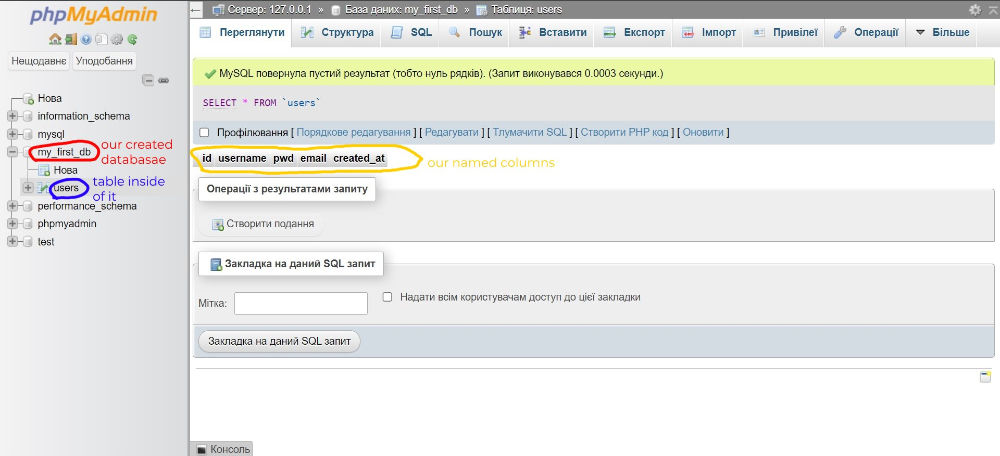

In this example we have created five columns: id, username, email, pwd and created_at. Here we see a few new keywords. Let's explain them all:  
***NOT NULL*** - By using this keyword, we dont allow to be this field ever empty;  
***AUTO_INCREMENT*** - It is a built-in attribute, which increments value in every new row. We make it, because id must be something special for every user in our database, so we can easily access him by searching for it.   
***PRIMARY KEY*** - As I said, every table must have a column with unique identifier, and by using *PRIMARY KEY* we mark such column;   
***DEFAULT*** - With help of this keyword we can set a default value, if this field is empty. In our case we set value *created_at* to *CURRENT_TIMESTAMP* by default;  
***CURRENT_TIMESTAMP*** - returns a timestamp (amount of seconds since 1970-01-01 00:00:00 UTC) at the time we append any new user;

## Signed and unsigned keywords?

***SIGNED*** and ***UNSIGNED*** keywords are coming, when we use numeric datatypes. By default all numeric datatypes can contain positive numbers and negative as well, so we have a certain limit of numbers, which we can store in an datatbase item (For example -2147483648 to 2147483647 for *INT* datatype). By default every numeric datatype uses SIGNED property so it can contain positives and negatives. But we can also set it to UNSIGN if we need to, and the range we will be able to store inside this database item will be only positive and two times greather than it was (Not -2147483648 to 2147483647 for *INT*, but 0 to 4 294 967 295). It happens, because in SQL we have a certain amount of bites we can store inside each datatype, and by using UNSIGNED keyword we free all bites, which were for negative numbers and give them to positive ones.

## How to insert, update and deleate data?

To perform a functionality of all keywords in this part of article, we will use the *users* table, created above. We have there following fields: *id*, *username*, *email*, *pwd* and *created_at*. Out all of them we just need to put *username*, *email* and *pwd*, becuase *id* will be increasing automatically and for *created_at* field will be created a current tampstamp.

For inserting data we can use ***INSERT INTO*** statament.
```sql
INSERT INTO users (username, email, pwd) VALUES ('SERHII', 'random@gmail.com', '123321');  
```

And here how it looks like:
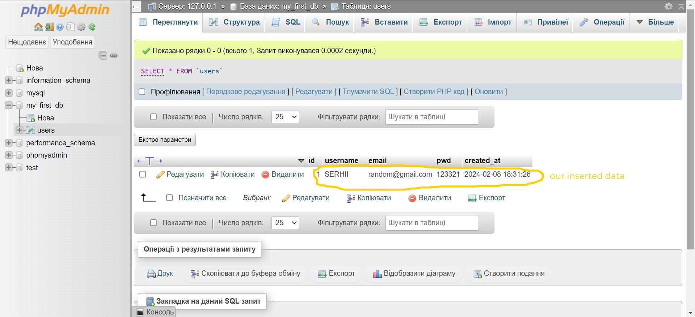


And let's immediately add one more item to our table, to see *id* and *created_at* automaticaly inserted:
```sql
INSERT INTO users (username, email, pwd) VALUES ('Viki123', 'Vk312@gmail.com', 'rp098045');
```
Result:
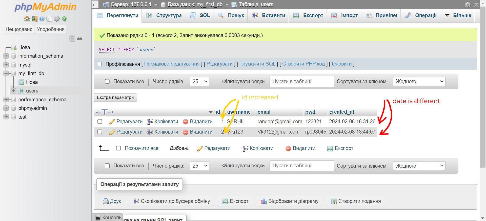

***UPDATE*** keyword is used for updating data. For example let's change the username and the email of second user in our table:
```sql
UPDATE users SET username = 'Viktoriia', email = 'Viktoriia@gmail.com' WHERE id = 2
```
In this expretion we specify which table, which column and finally which row we want to update. And following result will be shown:
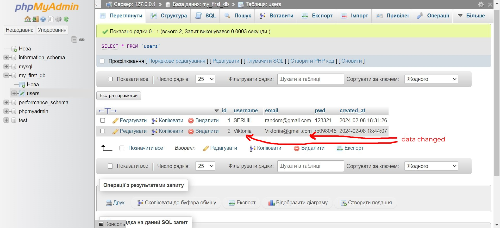

***DELETE FROM*** - expretion for deleating rows from the table. Let's deleate a first user form our table which is *SERHII*:
```sql
DELETE FROM users WHERE username = "SERHII"
```
In this example we address not to id, but to username, to deleate a row, which we do not need anymore.
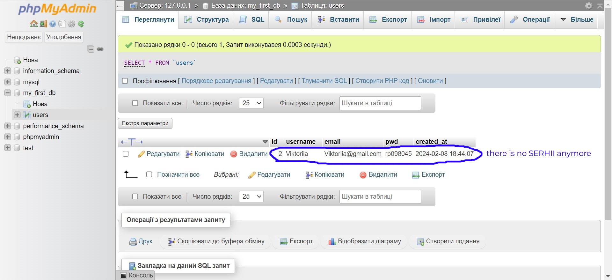

## Foreign key?

Let's imagine, that we are creating a website, where users have ability to sign up and inside of table *users* we collect all of them. It would be also nice, if signed up users could leave a comment. So let's create a new table called *comments*:
```sql
CREATE TABLE comments (
	  comment_id INT(11) PRIMARY KEY AUTO_INCREMENT,
    comment_text VARCHAR(500) NOT NULL,
    commented_at TIMESTAMP NOT NULL DEFAULT CURRENT_TIMESTAMP,
    users_id INT(11) NOT NULL,
    FOREIGN KEY (users_id) REFERENCES users(id)
);
```
We have used an unknown for us keyword *FOREIGN KEY*, but for now let's just have a look to the table:
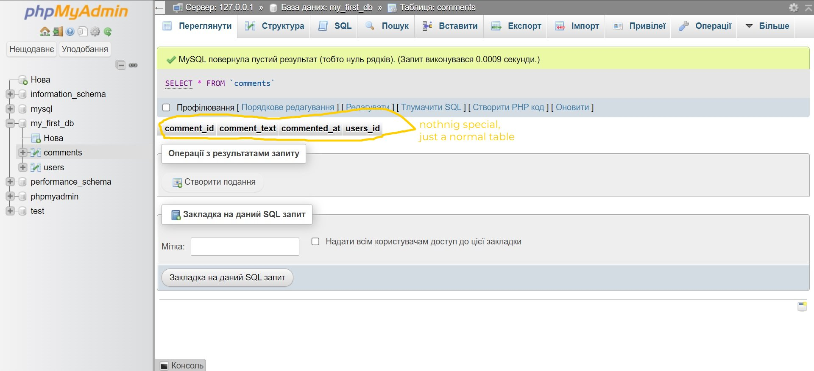

Nothing special jet, just normal table. But what if we put a new row inside of it with a new comment:
```sql
INSERT INTO comments (comment_text, users_id) VALUES ('It is absolutely awesome!', 2);
```
As a result we will become a new row inside of *comments*. But not just normal one. It is related to *users* table and we can see it by hovering users_id field:
<a href="https://drive.google.com/file/d/1uMgOZsN1JQt9fcNJL0bhJsbu1O8186yK/view?usp=sharing">see video</a>

If we will try to append a row to the *comment* table with an not-exicting *users_id* from *users* table, it will output us an error:
```sql
INSERT INTO comments (comment_text, users_id) VALUES ('What a beautiful video', 10); -- 10 is not exicting user id in the users table
```
Result:


## Selecting data and joins?

Until now we have leraned how to create tables and databases, how to insert, deleate, update data inside tables and how to build reletionships between multiple tables with help of *FOREIGN KEY*. One more big part that we need to learn is, how to select data from table if we want for example to show it on our web page or in an application. In this part of the article we will cover this topic.

We need to fill our two tables *users* and *comments* with data to manipulate with it. SQL has no such algorithm as any programming language to do it with just one block of code (loop). So we need to do it manualy by repeating *INSERT INTO* as many times as we want. 

We have following two tables:
*users*:
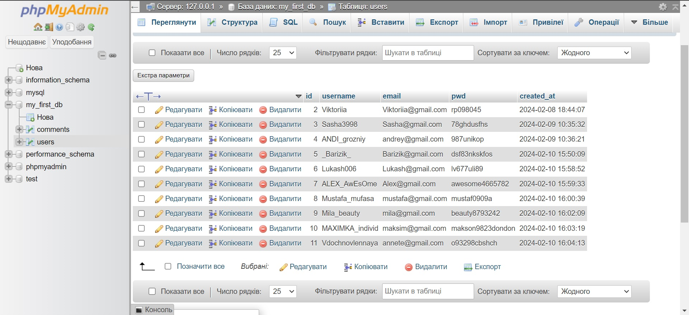


And *comments*:
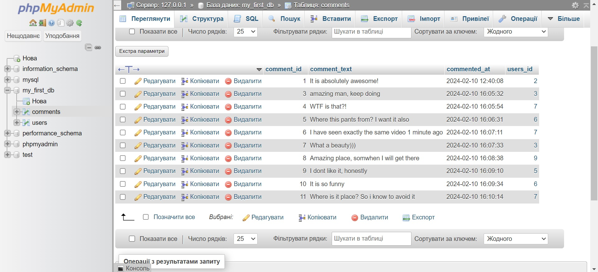

First of all, let's try to select all data from *users* table. We need ***SELECT FROM*** statement for it:
```sql
SELECT * FROM users; -- '*' sign represents all data
```
And as th output we just will recieve *users* table itself.

What if we want to select a special row, for example with username of Lukash006:
```sql
  SELECT * FROM users WHERE username = 'Lukash006';
```
Following result will be shown:
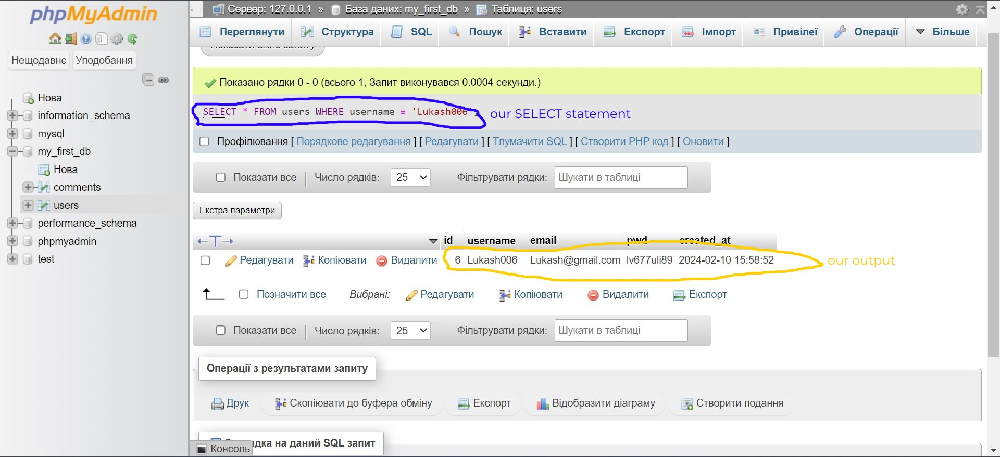

We can also specify which column we want to grab. Just write a name of column instead of * after *SELECT* keyword:
```sql
SELECT username FROM users WHERE username = 'Lukash006';
```
Only one value will be shown:
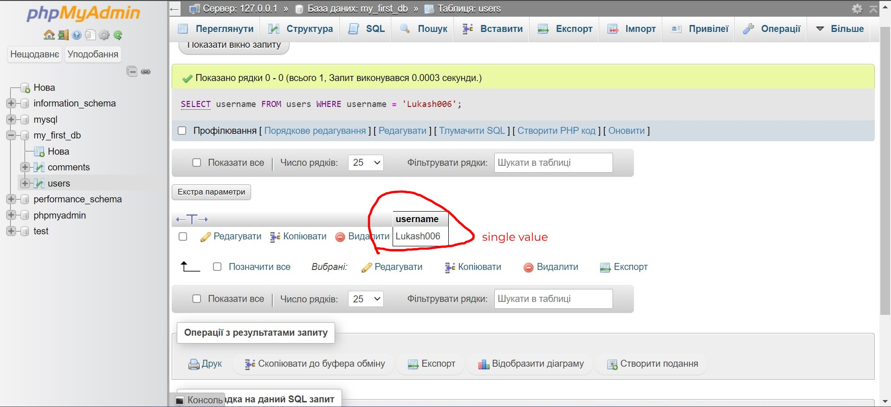

How you already understand, after *SELECT* keyword we specify which column we want to grab and after *WHERE* keyword we write a 'filter', which tells SQL which row we want to grab.

***JOIN***  keyword is a reason, why we need two tables with data in this chapter. It allows us two select multiply tables joined to each other by a special column. There a few types of joins as ***INNER JOIN***, ***LEFT JOIN*** and ***RIGHT JOIN***. First of all let's have a look, how do we use *INNER JOIN*:

```sql
SELECT * FROM users INNER JOIN comments ON users.id = comments.users_id;
```
This line of code selects all rows from *users*, all rows from *comments* and joins those rows together, which has id = users_id:
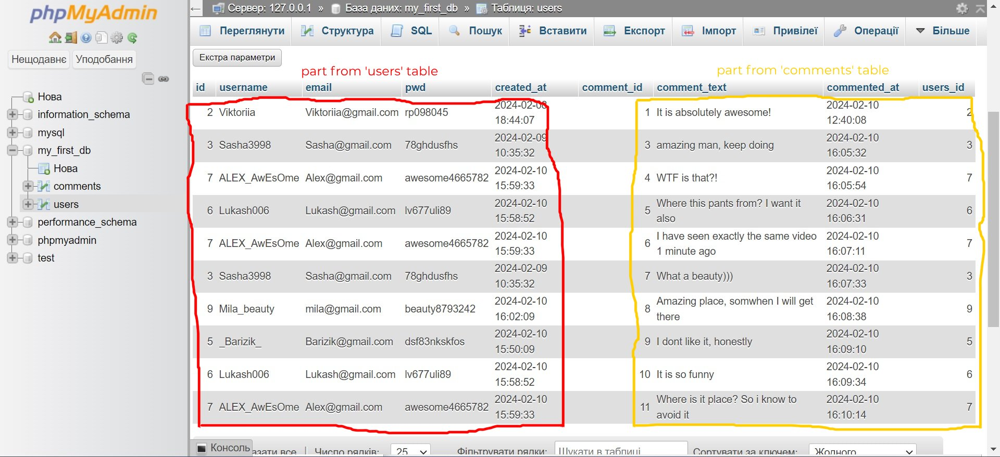

As we see, in this output we see no users, that are haven't written a comment. Thay wasn't grabbed. It is a feature of *INNER JOIN*. It doesn't grab rows, which have no matches.

But what grabes the rows even without matches is *LEFT JOIN* and *RIGHT JOIN*. By specifying right or left, we tell SQL which part of joined table will be main. If we specify it as *LEFT JOIN*, all values from left table will be grabbed (in our case users). If the user have not written a single comment, right part of the row will be filled with NULLs:
```sql
SELECT * FROM users LEFT JOIN comments ON users.id = comments.users_id;
```
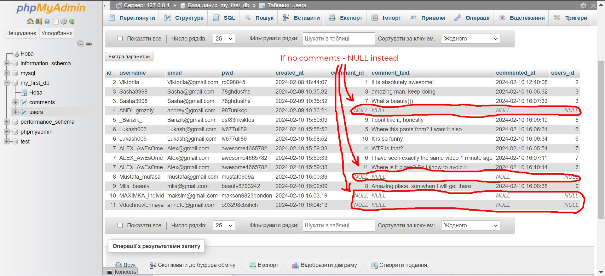

## How to change a structure of exicting table?

As last thing, we will see, how to change the structure of already exicting table after we created it with help of *CREATE TABLE*. 

Very often we need to add a new column or to deleate an exicting one, to change the datatype or size. For this all tasks is ***ALTER*** keyword siutable.

Here how we can add a new column:
```sql
ALTER TABLE users ADD COLUMN sex CHAR NOT NULL;
```
Result:
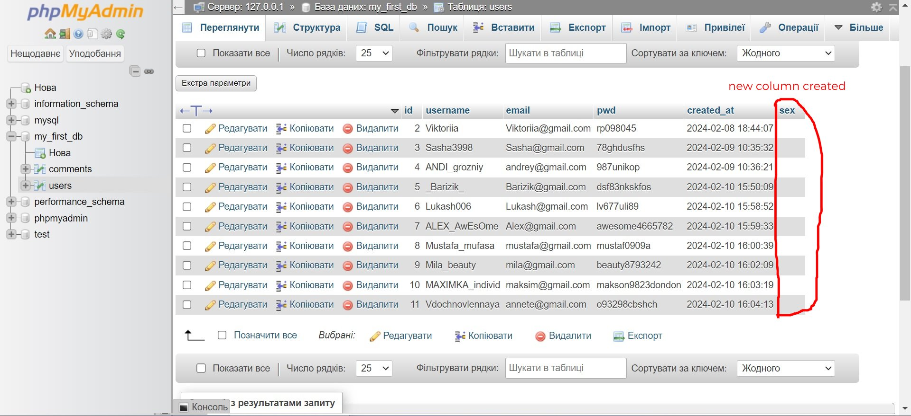

To delete any column use following expression:
```sql
ALTER TABLE users DROP COLUMN sex;
```
As result we will get same table, as before adding column *sex*.

To change datatype or size of a column we can also use *ALTER*:
```sql
ALTER TABLE users ALTER COLUMN pwd VARCHAR(200);
```
Now the size of *pwd* column in *users* is 200 characters, and not 255, like we defined it at very beginning.


___

Link to the w3school tutorial about sql you will find <a href="https://www.w3schools.com/sql/">here</a>.

