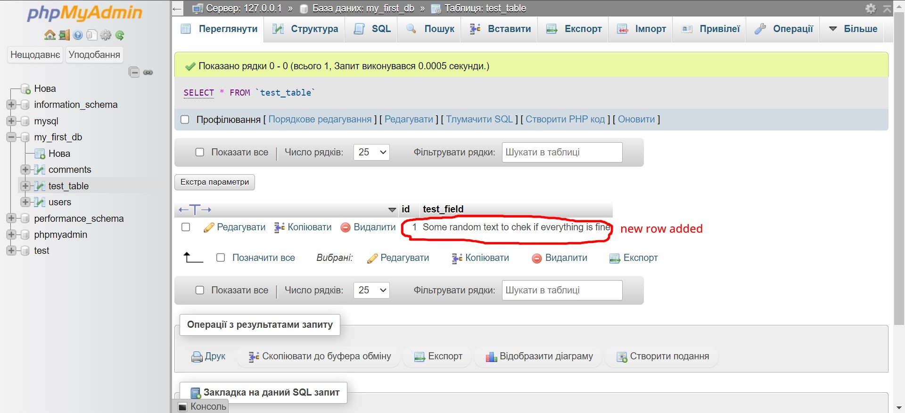

# 13.PHP - Mysqli, connection to MySQL server with PHP

In previous chapter we learned basic queries in SQL language and now let's talk how to do all those queries from PHP code.
There are three potential ways to do that:
- Mysql extention;
- Mysqli extantion;
- PDO extantion;

Mysql extention is the first and the oldest way to connect to a database. It has been removed in 7th version of PHP, because it was already to old fashioned and complicated to work with.

Mysqli ('i' stands for 'improved') is more usable und modern way to connect to SQL database. It has mor features comparing to Mysql and it is much easier to work with.

PDO - is more edvanced concept, but it is also more professional way to interact with databases, because unlike Mysqli, PDO can build a connection to other Databases, such as PostgreSQL, SQLite and so on.

In this chapter we will completely cover only Mysqli extention

## How to conect to a database with Mysqli?

Mysqli extention supports procedural ans object oriented aproaches. We will see examples using both of them.

***mysqli_connect("host", "username", "password", "databasename")*** - function to connect to a databse in procedural way:

```php
$host = "localhost";
$db_username = "root";
$db_password = "";
$db_database_name = "my_first_db";

$connection = mysqli_connect($host, $db_username, $db_password, $db_database_name); // I use phpmyadmin to interact with database and i use it locally, that's why i have no password. If i would publish my website to internet, i naturally had a password and a unique username

// If we have no database yet, we can leave it empty
```
To connect to Mysqli with OOP, use following syntax:
```php
$host = "localhost";
$db_username = "root";
$db_password = "";
$db_database_name = "my_first_db";

$connection = new mysqli($host, $db_username, $db_password, $db_database_name); // Unlike procedural approach, here we create an object, which is instance of mysqli class
```

# How to check connection?

To check if connection is successful you can use try... catch statement:
```php
$host = "localhost";
$db_username = "root";
$db_password = "";
$db_database_name = "my_first_db";

try {
    $connection = new mysqli($host, $db_username, $db_password, $db_database_name); 
    echo "enother code to execute if no error";
} catch (Exception $e) {
    echo "Connection failed";
} // In try block we put code, wich we want to execute and wich might contain errors. Catch block tells, what we want to do if in try-block was an error. $e is object, which contains all information about error

// In our situation it prints out "enother code to execute if no error", because we have no errors and code doesn't reach catch-block
```

Let's try to write a wrong *$db_username* and see what will happen if error exists:
```php
$host = "localhost";
$db_username = "wrong_username°^^^0))";
$db_password = "";
$db_database_name = "my_first_db";

try {
    $connection = new mysqli($host, $db_username, $db_password, $db_database_name); 
    echo "enother code to execute if no error";
} catch (Exception $e) {
    echo "Connection failed";
} // This time it prints "Connection failed"
```

If we want to print more details about this error, we can use ***mysqli_connect_error()*** function or ***getMessage()*** method of *$e* object: 
```php
$host = "localhost";
$db_username = "wrong_username°^^^0))";
$db_password = "";
$db_database_name = "my_first_db";

try {
    $connection = new mysqli($host, $db_username, $db_password, $db_database_name); 
    echo "enother code to execute if no error";
} catch (Exception $e) {
    echo "Connection failed => " . mysqli_connect_error();
}

// prints "Connection failed => Access denied for user 'root'@'localhost' (using password: YES)"
```
Or
```php
$host = "localhost";
$db_username = "wrong_username°^^^0))";
$db_password = "";
$db_database_name = "my_first_db";

try {
    $connection = new mysqli($host, $db_username, $db_password, $db_database_name); 
    echo "enother code to execute if no error";
} catch (Exception $e) {
    echo "Connection failed " . $e->getMessage(); 
}

// Also prints "Connection failed => Access denied for user 'root'@'localhost' (using password: YES)"
```

## How to send the queries to MySQL server?

***mysqli_query()*** - is a function, which we can use to send SQL queries to actual database. We need Our *$connection* variable for it:
```php
$host = "localhost";
$db_username = "root";
$db_password = "";
$db_database_name = "my_first_db";

$connection = mysqli_connect($host, $db_username, $db_password, $db_database_name);

$sql_query = "CREATE TABLE test_table (
    id INT(11) NOT NULL AUTO_INCREMENT PRIMARY KEY,
    test_field VARCHAR(225) NOT NULL
);";

mysqli_query($connection, $sql_query);
```
Following result will be shown in our database:


For Object oriented method use following syntax:
```php
$host = "localhost";
$db_username = "root";
$db_password = "";
$db_database_name = "my_first_db";

$connection = new mysqli($host, $db_username, $db_password, $db_database_name);

$sql_query = "CREATE TABLE test_table (
    id INT(11) NOT NULL AUTO_INCREMENT PRIMARY KEY,
    test_field VARCHAR(225) NOT NULL
);"

$connection->query($sql_query); // result will be the same
```

Let's try to append new data to this table:
```php
$sql_append_data_query = "INSERT INTO test_table (test_field) VALUE ('Some random text to chek if everything is fine')";

$connection->query($sql_append_data_query);
```
Result:


## How to fetch data from database?

If we want to fetch a single item from our database, use ***mysqli_fetch_array()*** function. We need to use query for it:
```php
$host = "localhost";
$db_username = "root";
$db_password = "";
$db_name = "my_first_db";

$connection = mysqli_connect($host, $db_username, $db_password, $db_name);

$sql_query = "SELECT * FROM users WHERE id = 3"; // query for reciving ONLY ONE user

$response = mysqli_query($connection, $sql_query);

$data = mysqli_fetch_array($response, MYSQLI_ASSOC); // Here as a second parameter we can specify wich array we want to get - either associative or numeric. MYSQLI_ASSOC for associative, MYSQLI_NUM for numeric

/* As a result we recive associative array from our database created on 11.sql chapter:
array(5) {
  ["id"]=>
  string(1) "3"
  ["username"]=>
  string(9) "Sasha3998"
  ["email"]=>
  string(15) "Sasha@gmail.com"
  ["pwd"]=>
  string(10) "78ghdusfhs"
  ["created_at"]=>
  string(19) "2024-02-09 10:35:32"
} */
```

Here how we can do it using object oriented approach:
```php
$host = "localhost";
$db_username = "root";
$db_password = "";
$db_name = "my_first_db";

$connection = new mysqli($host, $db_username, $db_password, $db_name);

$sql_query = "SELECT * FROM users WHERE id = 3";

$response = $connection->query($sql_query);

$data = $response->fetch_array(MYSQLI_NUM); // This time we are fetching numeric array

// result will be the same, exept type of array
```

If we want to fetch multiple rows from a table, use ***mysqli_fetch_all()***:
```php
$host = "localhost";
$db_username = "root";
$db_password = "";
$db_name = "my_first_db";

$connection = mysqli_connect($host, $db_username, $db_password, $db_name);

$sql_query = "SELECT * FROM users WHERE id > 5"; // query for reciving MULTIPLE users

$response = mysqli_query($connection, $sql_query);

$data = mysqli_fetch_all(MYSQLI_ASSOC); // we will recive all users with id greather than 5 in an associative array.
```
And as usual, same code but for OOP:
```php
$host = "localhost";
$db_username = "root";
$db_password = "";
$db_name = "my_first_db";

$connection = new mysqli($host, $db_username, $db_password, $db_name);

$sql_query = "SELECT * FROM users WHERE id > 5";

$response = $connection->query($sql_query);

$data = $response->fetch_all(MYSQLI_NUM);
```


